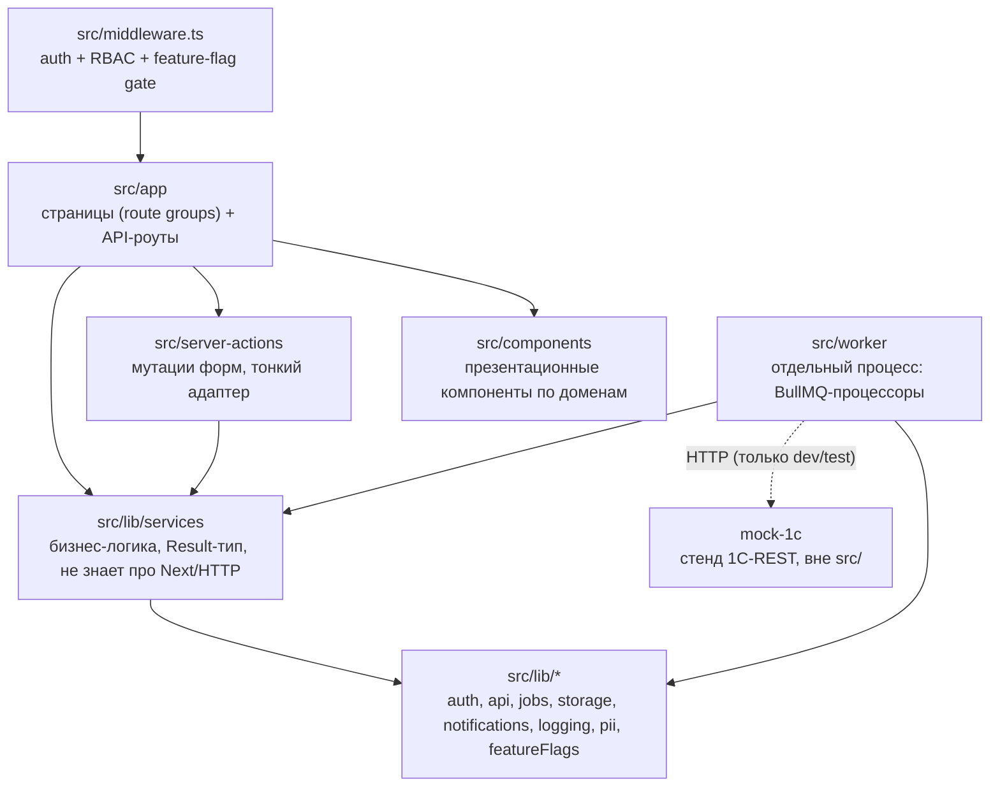
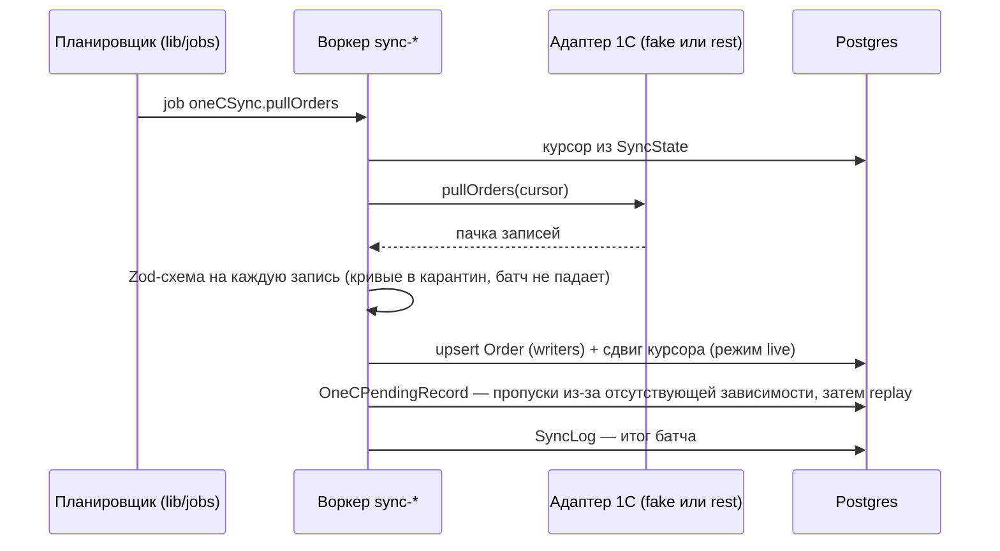
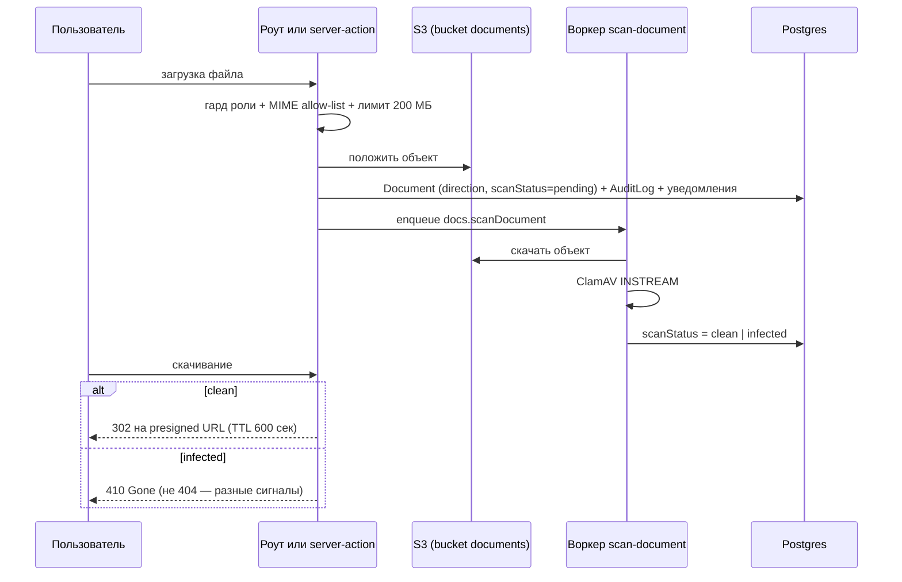
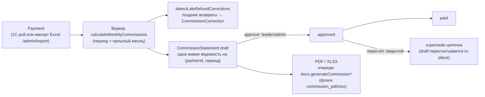

# Архитектура lk-otsfera — карта системы

Цель документа — дать новому разработчику войти в проект за день. Здесь только
карта; правила работы (команды, тесты, стиль) — в [CLAUDE.md](../CLAUDE.md),
формальные требования — в [ТЗ продукта v0.5](tz/2026-07-29-tz-lk-otsfera-v0.5.md).

## 1. Что это

Личный кабинет компании «Промтехносфера» — платформа взаимодействия компании,
оказывающей услуги по охране труда (и смежным направлениям: пожарная
безопасность, электробезопасность), с её клиентами: заявки на обучение, обмен
документами, счета/оплаты, переписка по сделкам, расчёт партнёрской комиссии.
Шесть ролей: три сотрудника (admin, руководитель-leader, manager) и три
клиентских (partner-посредник, organization-прямой заказчик, student-слушатель).
**Критичный инвариант терминологии:** `Company` — компания-**продавец**
(контур сотрудников, граница изоляции C8), `Organization` — **клиент**
(заказчик обучения). Не путать: почти все правила scope построены на этой паре.

Стек: Next.js 15 (App Router) · React 19 · TypeScript strict · Prisma 5 +
PostgreSQL · S3-хранилище · BullMQ + Redis · Vitest · Playwright
([CLAUDE.md §1](../CLAUDE.md)).

## 2. Карта слоёв

Направление зависимостей `app → server-actions → services → lib` защищено
механически: [.dependency-cruiser.cjs](../.dependency-cruiser.cjs), команда
`npm run boundaries` (входит в `verify` и CI). Правила: no-circular, из
`lib/**` нельзя импортировать вверх, из `components/**` — в базу, из
`worker/**` — UI, из `src/**` — `mock-1c`. Детали — [CLAUDE.md §2](../CLAUDE.md).

## 3. Каталоги

| Путь | Что там | README |
|---|---|---|
| `src/app/` | Страницы по кабинетам (`admin/`, `leader/`, `manager/`, `partner/`, `organization/`, `student/`, `(auth)`) + `api/` route handlers | — |
| `src/components/` | Клиентские/презентационные компоненты по доменам; примитивы в `ui/` | `src/components/README.md` (пишется, фаза 9) |
| `src/server-actions/` | Мутации форм; тонкий адаптер над services | — |
| `src/lib/services/` | Бизнес-логика по доменам (orders, commission, oneCSync, documents, enrollments, …), контракт Result-типа | `src/lib/services/README.md` (пишется, фаза 9) |
| `src/lib/auth/` | JWT, `requireRole`/`requireManager`, policy-модули, `access.ts` (protectedPrefixes) | `src/lib/auth/README.md` (пишется, фаза 9) |
| `src/lib/api/` | Обвязка роутов: `withAuth`, `parseJsonBody`/`jsonError` | `src/lib/api/README.md` (пишется, фаза 9) |
| `src/lib/jobs/` | Конфиг очередей BullMQ ([queues.ts](../src/lib/jobs/queues.ts), scheduling) |  — |
| `src/lib/storage/` | S3-порт + адаптер (server-only) | — |
| `src/lib/notifications/` | fan-out уведомлений (managers/org/partner) + email | — |
| `src/lib/logging/`, `src/lib/pii/` | pino + `scrub()` ПДн; журнал доступа к ПДн | — |
| `src/worker/` | Процесс воркера: 19 процессоров (1С-синк, скан, комиссии, уведомления, телефония) | `src/worker/README.md` (пишется, фаза 9) |
| `src/middleware.ts` | Auth + RBAC + feature-flag gate до рендера | — |
| `prisma/` | [schema.prisma](../prisma/schema.prisma) (~80 моделей) + миграции (применённые не редактировать) | — |
| `mock-1c/` | Dev-стенд 1С REST API, вне `src/`, в прод не попадает | [mock-1c/README.md](../mock-1c/README.md) |
| `docs/` | ТЗ + STATUS, инварианты, runbooks, спеки/планы (`superpowers/`) | — |

Основные группы моделей в `prisma/schema.prisma`: клиенты и доступ (`Company`,
`Partner`/`PartnerUser`, `Organization`/`OrganizationUser`, `User`,
`AccessProfile`), сделки (`Lead`, `Deal`, `ClientRequest`, `Order`/`OrderItem`,
`OrderStatusDefinition`), финансы (`Payment`, `CommissionStatement`/`Item`,
`CommissionCorrection`, `PaymentImportBatch`), обучение (`Student`,
`EnrollmentRequest`, `TrainingDirection`, `Certificate`), документы
(`Document`, `Upload`), 1С-синк (`SyncState`, `SyncLog`, `OneCPendingRecord`),
коммуникации (`OrderThread`/`Message`, `Comment`, `StaffConversation`,
`InboundMessage`, `Call`, `Notification`), служебные (`AuditLog`,
`PiiAccessEvent`, `CustomFieldDefinition`/`Value`).

## 4. Роли и границы видимости

Роль лежит в `User.role` (enum: admin, manager, partner, organization,
student); «руководитель» — это `role=manager` + `managerRole='leader'`.
Маршрутные префиксы — в [src/lib/auth/access.ts](../src/lib/auth/access.ts).

| Роль | Кабинет | Граница видимости |
|---|---|---|
| **admin** | `/admin` | Всё, через **Model A**: зеркало `/admin/*` + `policy.ts` (`return true`). В чужие кабинеты не входит — page-гарды бьют. |
| **leader** (руководитель) | `/leader` (middleware пускает role=manager, суб-роль режет серверный гард `requireManagerLeader`) | Вся своя `Company`, включая комиссии, ставки, настройки, подтверждение расчётов. |
| **manager** | `/manager` | **Mode-aware (C8)**: при `Company.managerTeamVisibility=ON` — вся компания, при OFF — свои + закреплённые (`managedOrgIds`). Кросс-company изоляция всегда. **Комиссию не видит никогда** (серверная проверка). Опционально `AccessProfile` (трек G1) с уровнями own/assigned/all. |
| **partner** | `/partner` | Свои организации; членство `PartnerUser` (`roleInPartner`, `assignedOrgIds`). Видит **свою** комиссию. |
| **organization** | `/organization` | Только своя организация; членство `OrganizationUser` (`roleInOrg`). Комиссию не видит. |
| **student** | `/student` — намеренный shared-entry | Кабинета нет: bridge-переход во внешнюю СДО (одноразовый код, `StudentBridgeGrant`, JWT только с контрактными claims, без PII). |

Топ-3 инварианта доступа (полный список + тесты — [INVARIANTS.md](INVARIANTS.md)):

1. **Изоляция компаний** (№5): companyA не видит и не меняет данные companyB —
   в обоих режимах `managerTeamVisibility`.
2. **`see_commission` — по активной роли сессии** (№6): партнёрская сессия
   видит комиссию, организационная сессия того же человека — нет; менеджер — никогда.
3. **Cross-partner gate ставки** (№3): индивидуальная ставка чужой организации
   не протекает на другого партнёра.

RBAC — defense-in-depth в трёх местах (middleware → route/action-гард →
scope-фильтрация в сервисе), ни один слой не сокращать — [CLAUDE.md §4](../CLAUDE.md).
Feature flags (staged rollout кабинетов, каналы, поведенческие) —
[src/lib/featureFlags.ts](../src/lib/featureFlags.ts) и [CLAUDE.md §5](../CLAUDE.md).

## 5. Ключевые потоки данных

### 5.1. Синхронизация с 1С (pull)

Адаптер выбирается настройкой `onec.adapter` (`fake` | `rest`; из
`/admin/settings/integrations` или env `ONE_C_ADAPTER`) — фабрика
[src/lib/services/oneCSync/index.ts](../src/lib/services/oneCSync/index.ts).
Очереди `oneCSync.{pullOrders,pullPayments,pullDocuments,pullOrganizations,pushLead,reconcile}`.

Dead-letters двух видов: **упавшие job'ы** остаются в BullMQ
(`removeOnFail: false` — намеренно, [CLAUDE.md §7](../CLAUDE.md)) и
**out-of-order записи** копятся в `OneCPendingRecord` и доигрываются, когда
появляется зависимость (организация/заказ). Файлового адаптера нет — файловый
обмен это ручной импорт Excel через `/admin/import`.

### 5.2. Документ: upload → скан → скачивание

Файл никогда не отдаётся сквозь приложение — только presigned URL
([CLAUDE.md §10](../CLAUDE.md)). Эталон тонкого роута —
[api/manager/documents/[id]/upload](../src/app/api/manager/documents/%5Bid%5D/upload/route.ts).
Асимметрия sibling-страниц: у organization-кабинета upload через
server-action, у manager — через API-роут.

### 5.3. Комиссия партнёра

Правила расчёта закреплены инвариантами ([INVARIANTS.md](INVARIANTS.md) №1–4):
база = полная сумма платежа (НДС не вычитается, `vatAmount` справочно);
приоритет ставки — override организации → историческая ставка партнёра на
дату `paidAt` → дефолт партнёра. Код —
[src/lib/services/commission/](../src/lib/services/commission/) и
[src/worker/processors/calculate-monthly-commissions.ts](../src/worker/processors/calculate-monthly-commissions.ts).

## 6. Два UX

- **Кабинеты сотрудников** (`/admin`, `/leader`, `/manager`) — плотные,
  CRM-стиль: воронка лидов/сделок, канбан задач, календарь, телефония,
  входящая почта, staff-чат, отчёты, настройки справочников.
- **Клиентские кабинеты** (`/partner`, `/organization`, `/student`) —
  максимально простые: заявки, документы, счета/оплаты, переписка с
  менеджером; у партнёра — плюс свои организации и комиссия; у слушателя —
  вообще только переход в СДО.

Из этого следует **sibling-паттерн компонентов** ([CLAUDE.md §4](../CLAUDE.md)):
компонент, нужный partner-у и organization-у, не делается общим «на всякий
случай» — создаются версии `partner-*`/`organization-*` (исключение — строго
презентационные с domain-agnostic типом). Домены расходятся, общий компонент
быстро становится клубком условий.

## 7. Куда смотреть дальше

- [CLAUDE.md](../CLAUDE.md) — правила работы: команды, слои, тесты, флаги, безопасность.
- [docs/INVARIANTS.md](INVARIANTS.md) — инварианты продукта, каждый закреплён тестом.
- [docs/RUNBOOK.md](RUNBOOK.md) — эксплуатация; смежные runbook'и лежат рядом (`docs/runbook-*.md`).
- [docs/CI.md](CI.md) — CI и лестница локальных хуков.
- [docs/REPO_AUDIT.md](REPO_AUDIT.md) — аудит фазы 0: фактическое состояние и находки.
- [docs/tz/STATUS.md](tz/STATUS.md) — **какое ТЗ действующее и что делать дальше** (единственный источник правды о прогрессе). Сейчас действующее — [ТЗ понятности интерфейса и закрытия функциональных пробелов](tz/2026-08-08-tz-usability-and-core-gaps.md) (77 требований `У-N`, 9 этапов); [ТЗ продукта v0.5](tz/2026-07-29-tz-lk-otsfera-v0.5.md) остаётся справочником по продукту, новых работ из него не берут, а [ТЗ починки импорта 1С](tz/2026-08-04-tz-fix-1c-import.md) закрыто 07.08.2026.
- [docs/tz/AUDIT.md](tz/AUDIT.md) — **реестр сверки кода с действующим ТЗ**: по каждому требованию якорь в коде, что проверять и вердикт (`✅` / `⏳ этап N` / `❌` / `⚠`). Протокол — CLAUDE.md §16.
